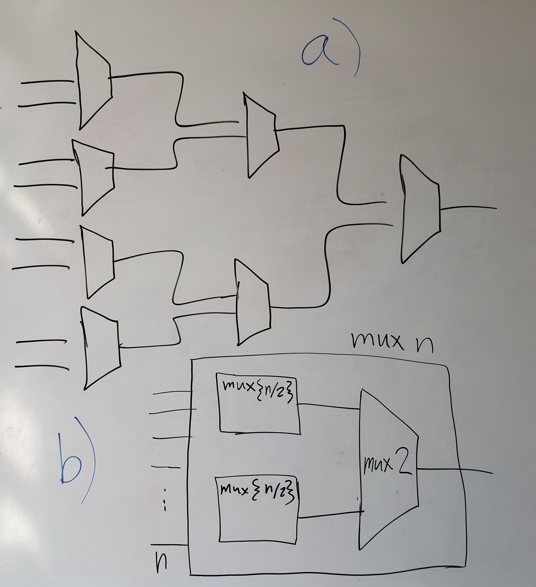

# Homework 4
### Ian Eykamp
#### Oct 12, 2022

## Implementation

I created python scripts to generate `.sv` files for arbitrarily-sized muxes and adders. They are both generated with recursive functions which compose the n-bit circuit from the smallest functional units, respectively the 2-bit mux and the 1-bit full adder.

The $n$-input mux is composed of $n-1$ 2-1 muxes arrayed in a logarithmic series as shown in Figure 1a. Assume $n$ is a power of 2; otherwise, the inputs are padded with zeroes to make it a power of 2. This is composed recursively using the block shown in Figure 1b. Each recursive block contains a 2-1 mux which switches between two inputs, which are in turn generated by similar recursive blocks which each switch between half of the remaining inputs.

**Figure 1.**

I used the ripple carry implementation for the $n$-bit adder. The $n$-bit adder is composed of $n$ 1-bit adders arranged in series, as shown in Figure 2a. This can also be composed recursively using the block shown in Figure 2b. Each recursive block appends a 1-bit adder onto the end of the previous recursive block.

**Figure 2.**

## Testing

It would be infeasible to test the 32-input mux and the 32-bit adder exhaustively, as this would require at least $2^{32}$ tests. My python scripts test the inputs exhaustively if it would require fewer than $2^{10}$ runs; otherwise, it generates $2^{10}$ random input combinations to validate.

## To run

Simply `make mux 32` and `make adder 32` will generate the required files and run the test scripts.

You should see a printout of no more than $2^{10}$ test cases and the results of the test (success or failure).

You can also do this for any size of mux and any size of adder. Try `make mux 5` and `make adder 8`, for example.