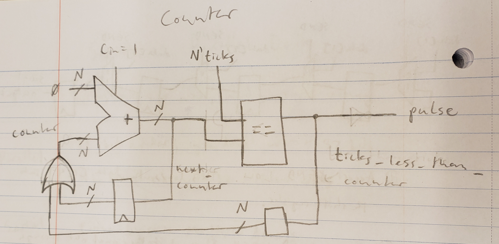
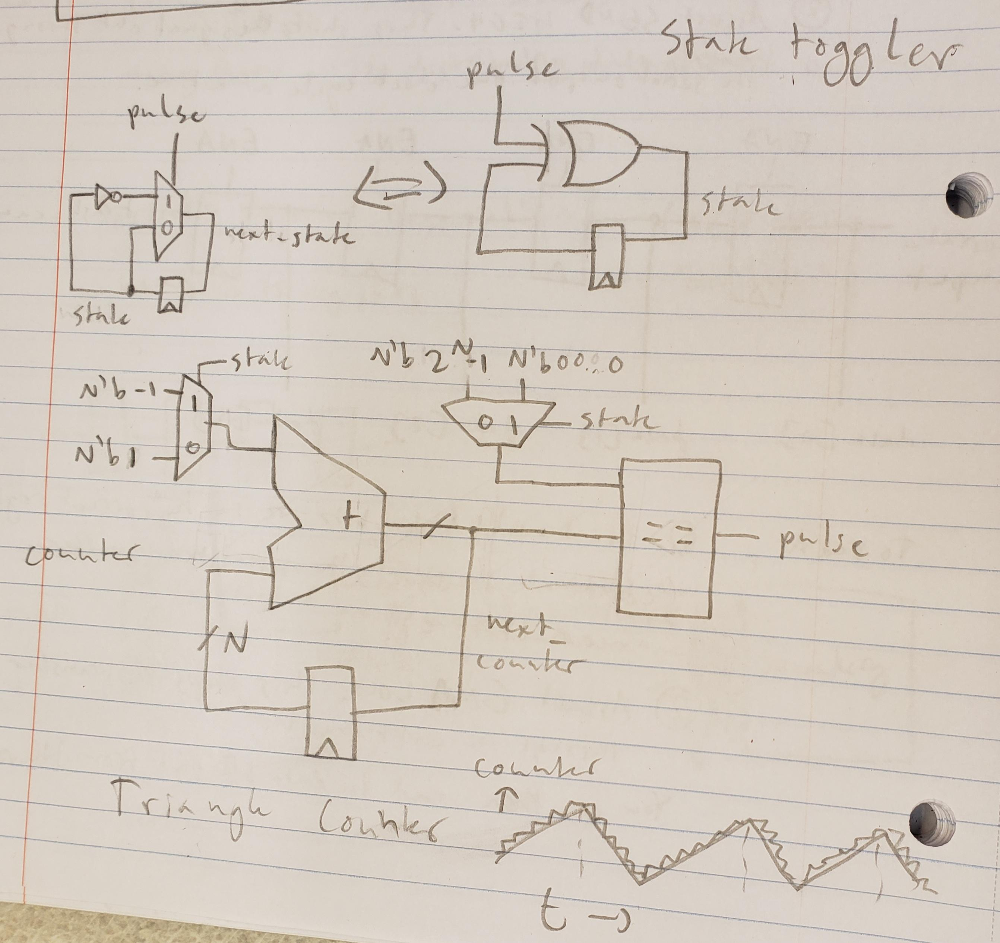
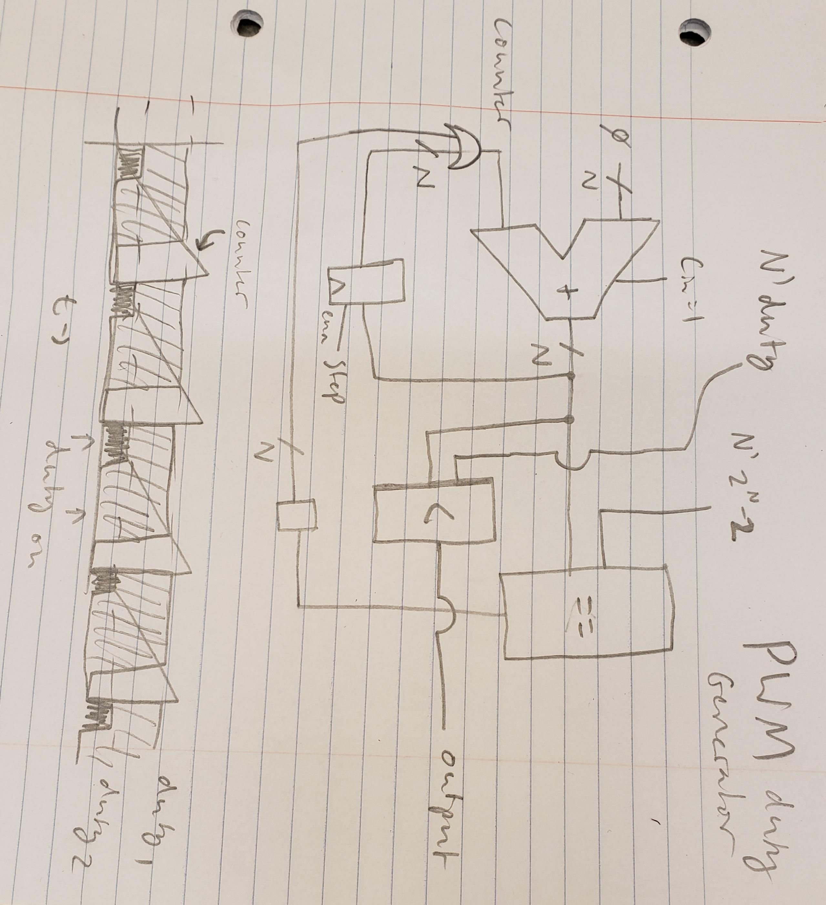

# CompArch Homework 5
### Ian Eykamp

Collaborators: *Benji helped get me unstuck on the less than comparator.*

## 1. The Magic Number Seven

a) In MATLAB, non-integer numbers are represented by a large number of decimal points, even when they could be succinctly represented by a simple mathematical expression, such as $\sqrt{2}$, which should reasonably take about 6 bits to convey (4 bits for the operator and 2 bits for the number).

b) On one discrete math homework problem, I needed to know whether I should explain a particular concept in more detail (I did not know if using an equation from the textbook was sufficient or not). This was a bit of information I did not have, so I omitted the explanation and lost points on the problem.

c) There are 56 words in the previous answer. Let us assume each word has an average of $8$ binary phonetic elements. Therefore, I used $8 \cdot 56 = 448$ bits.

d) A bit is a binary distinction in one variable. A chunk is a set of (usually binary) distinctions in many variables, or a sequence of distinctions in one variable that can be conceptualized as a single unit.

e) The ability to differentiate between thousands of faces is based on the extremely high dimensionality of face data. This is imitated very well by covariance-based machine learning processes like we learned in QEA 1, in which the first 10-20 eigenvectors form the basis of a space in which most people's faces principally differ. Therefore, computers can be trained to distinguish between images of faces by discriminating between 10-20 variables. 10-20 bits of information corresponds to 1,000-1,000,000 possible combinations of features.

## 2. Comparators

*(Thanks to Benji for help on the signed less than comparator).*

The equality comparator can easily be constructed from an AND of XNORs. An XNOR gate is TRUE when both inputs are zero or both inputs are one (i.e. when the bits are equal). The AND gate ensures that all N bits are equal.

The signed less than comparator has two stages. First, we compare the sign bits. If the `a` is positive (sign bit 0) and `b` is negative (sign bit 1), then `a` > `b`. If `a` is negative and `b` is postive, then `a` < `b`.

Else, if the sign bits are equal, we can subtract `b` from `a` without the risk of overflow. If the sign bit of `a - b` is negative, then `a` < `b`. If the sign bit of `a - b` is positive, then `a` > `b`.

For the unsigned less than comparator, the carry out bit is used. The result of the "subtractor" is `a + (~b + 1)` = `a + (2**n - b)` = `2**n + (a - b)`. If `a` < `b`, there is no carry out, because the result is less than $2^n$. If `a` >= `b`, then there is a carry out, because the result is greater than or equal to $2^n$.

## 3. Design Challenge

### Counter
For the counter, I use the carry in bit to increment an adder. The value `next_counter` flows through the register only on a clock rising edge. The output pulse is driven HIGH when the counter exceeds `ticks`. As soon as a pulse is generated, the next cycle, the counter is reset to `111...1` by the OR gate, which makes next_counter become zero. This turns the pulse off after one clock cycle.

**Figure 1. Counter Schematic.**

### Triangle Generator
The Triangle Generator is a finite state machine that switches between counting up and counting down. In the counting up state, the value 1 (`000...01`) is added to the count; in the counting down state, -1 (`111...1`) is added to the count. The counting up mode is exited when the count reaches `111...10`, and the counting down mode is exited when it reaches `000...001`. The reason the end conditions are off by one is that the counter overshoots and counts for one additional cycle; therefore, by stopping it early, it ends on exactly the correct value. 

The state is toggled when the counter reaches the exit condition, using the circuit at the top. The inputs to the adder and comparator are toggled using the equivalent of a MUX but implemented more primitively in code because I don't yet believe in if-else statements.

**Figure 2. Triangle Generator Schematic.**

## PWM Generator
The PWM module implements a basic counter that counts from $0$ to $2^N-2$. It cannot count all the way up to $2^N-1$, because that is the highest `duty` value that can be accepted, and for this value, the counter should always be less than `duty`. The output is very simply the result of a less than comparison between the counter and the `duty` numerator. It is on when `counter` < `duty` and off otherwise. When `duty` == `0`, then it is always off. Per the specifications, it only increments on clock cycles when `step` is HIGH.

**Figure 3. PWM Duty Cycle Schematic.**