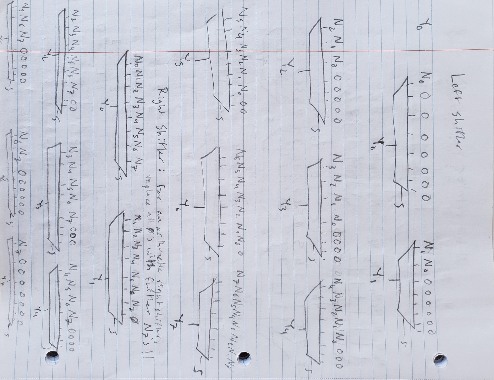
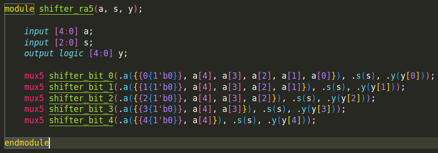
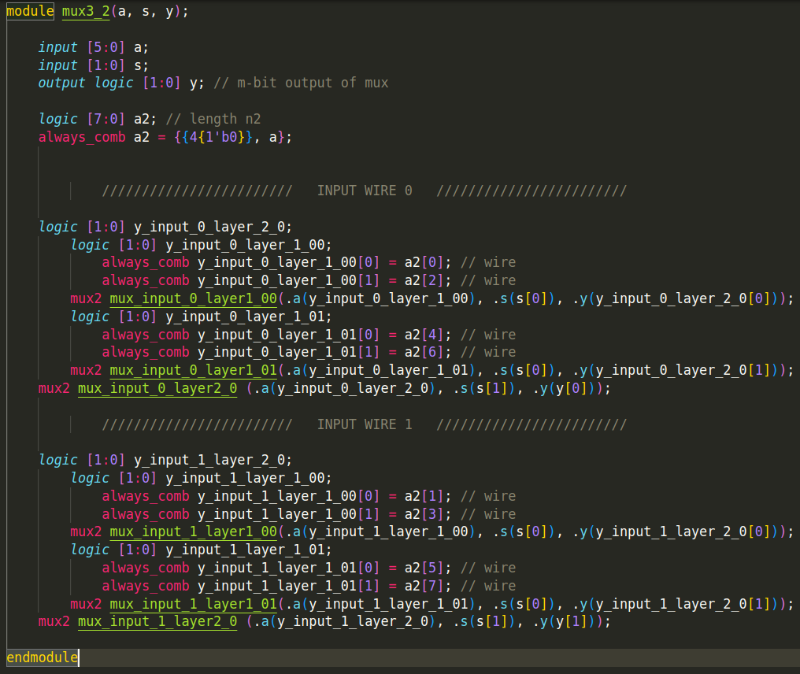

# Ian Eykamp Homework 6 Write-Up

## 1. Metastability and Designing for Failure

### (a) Estimating reasonable Mean Time Before Failure (MTBF)

#### Toy Piano:
1 year $\approx \pi \cdot 10^7$ seconds.
This could be a little lower, but 1 year is a convenient figure, and you can't always count on a toddler to know how to power cycle the device.

### Industrial Robot Arm:
100 years
Industrial machinery costs on the order of millions of dollars and could cause a lot of physical damage if it malfunctions, so a very large MTBF is warranted. Moreover, since the cost is already so large, and the robotic arm itself has a power draw much larger than the controller circuitry, the cost of bulking up the circuitry to increase the MTBF is relatively small.

### Vehicle ADAS (Automated Driver Assistance System):
10,000 years
Safety critical, so a single error within its lifetime is unacceptable. (Assume its lifetime is 50 years). The MTBF should be very large, subject to performance constraints, but not very sensitive to cost constraints, because human lives are more valuable than money.

## 2. ALU

### Shifter
My shifter code can be found in the `hw6/hdl/shifter` folder. Navigate into this directory and run `make shifter <n>`, where `<n>` is the number of bits the shifter should operate on. This will generate and test left, right, and arithmetic shifters with that number of bits.

I built the shifters using a series of $N$ nuxes, each of which corresponds to one bit output, as shown in Figure 1. For the left logical shift operation, `y = a << s`, the $s$ least-significant bits become zero while their values are shifted to more significant places. For the right logical shift `y = a >> s`, the $s$ most significant bits become zero; for the right arithmetic shift `y >>> s`, the $s$ most significant bits become `a[N-1]`. Arithmetic shift only makes sense for signed (two's complement) numbers.

**Figure 1.** Shematic for left, right, and arithmetic shifters.

**Figure 2.** HDL example for arithmetic shifter.

### Multi-bit MUX

For the ALU, I had to make a multi-bit mux, which I had never written the HDL for before. This code can be found in the `hw6/hdl/alu/multi_mux` folder. Navigate into this directory and run `make multi_mux <n>_<m>`, where `<n>` is the number of inputs and `<m>` is the number of bits in each input. Note the underscore between `<n>` and `<m>`. This will generate and test the $m$-bit, $n$-input mux.

The multi-bit mux is essentially a series of $m$ one-bit muxes, each of which corresponds to one bit of the output, as shown in Figure 3.

**Figure 3.** HDL example for a 2-bit, 3-input mux.

### ALU
My shifter code can be found in the `hw6/hdl/alu` folder. Navigate into this directory and run `make test_alu`. The ALU succeeds on all tests.

The operating principle of the ALU is it performs all the specified operations in parallel, then loads the results of these calculations into a 32-bit, $n$-input mux, where $n$ is the number of unique operations. The control input to the ALU acts as the select input for the mux.

To make the test cases work, I had to restrict the domain for the test case for the shifters such that $0 \le b \le 31$. I ignored overflow errors.

As an aside, an inverter is not needed as a separate ALU operation, because taking `a XOR {32{1'b1}}` produces the inverse of `a`, `~a`.

### Register File

The register file is constructed from 32 independent 32-bit registers. The reason explicit registers are needed is because they have an accessable enable control. On the writing side, the `wr_ena` and `wr_addr` signals control a decoder which selects which one of the registers is enabled; all registers are connected on with `wr_data` as their `D` input, so that when one of them is enabled, the data is written to that register.

On the reading side, all the register data is connected to two 32-bit 32-1 muxes which allow two of the registers to be read out simultaneously.

## Note from Ian
The biggest difficulties for me with this homework were

1) My personal file structure, whereby each module I have created is in its own separate folder, so in order to re-use a module from a separate folder, I have to copy-paste and then usually go in and change all the relative directories in the `include` statements. In the future, I will probably just get over my aversion to doing my work in the `hw/hdl` folder to avoid file path headaches.

2) My insistence on making all my modules from scratch, including the m-bit, n-input mux, instead of using behavioral logic or the provided modules.

3) Tech week did more to me than suck away all my time, it also made me overall sleep-deprived and generally unproductive during the day. When I did try and do work at night, I was certainly not at my best, and I should have used the time to catch up on sleep instead of catching up on assignments. I didn't do any work that I am proud of during the last week---for any class---, and I felt bad about turning in some of my assignments for my other classes when I knew they were not my best work. Thank you for being lenient and letting me manage my time the way I needed to. I am feeling much more productive this weekend after 8 hours of sleep and a stellar opening night of Assassins, and I am starting to bxe optimistic again about being able to catch up in all of my classes before (or at the very least during) Thanksgiving break.