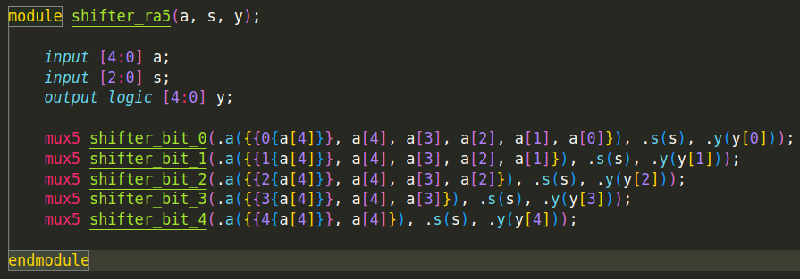

# Ian Eykamp Homework 6 Write-Up

## 1. Metastability and Designing for Failure

### (a) Estimating reasonable Mean Time Before Failure (MTBF)

#### Toy Piano:
1 year $\approx \pi \cdot 10^7$ seconds.
This could be a little lower, but 1 year is a convenient figure, and you can't always count on a toddler to know how to power cycle the device.

### Industrial Robot Arm:
100 years
Industrial machinery costs on the order of millions of dollars and could cause a lot of physical damage if it malfunctions, so a very large MTBF is warranted. Moreover, since the cost is already so large, and the robotic arm itself has a power draw much larger than the controller circuitry, the cost of bulking up the circuitry to increase the MTBF is relatively small.

### Vehicle ADAS (Automated Driver Assistance System):
10,000 years
Safety critical, so a single error within its lifetime is unacceptable. (Assume its lifetime is 50 years). The MTBF should be very large, subject to performance constraints, but not very sensitive to cost constraints, because human lives are more valuable than money.

## 2. ALU

### Shifter
I built the shifters using a series of $N$ nuxes, each of which corresponds to one bit output, as shown in Figure 1. For the left logical shift operation, `y = a << s`, the $s$ least-significant bits become zero while their values are shifted to more significant places. For the right logical shift `y = a >> s`, the $s$ most significant bits become zero; for the right arithmetic shift `y >>> s`, the $s$ most significant bits become `a[N-1]`.

**Figure 1.** Shematic for left, right, and arithmetic shifters.

**Figure 2.** HDL example for arithmetic shifter.

