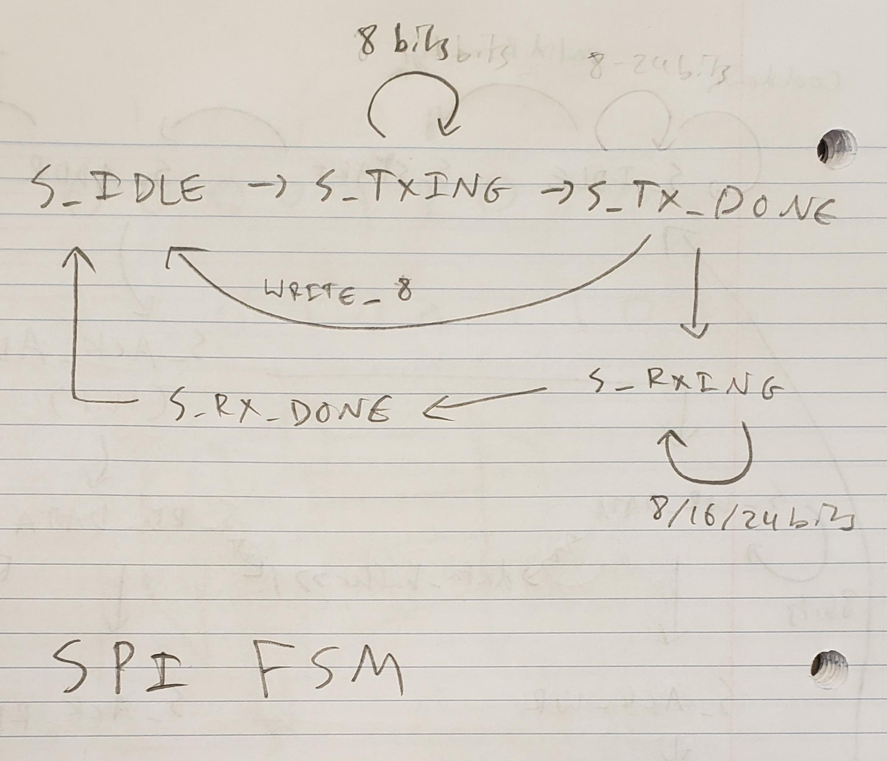
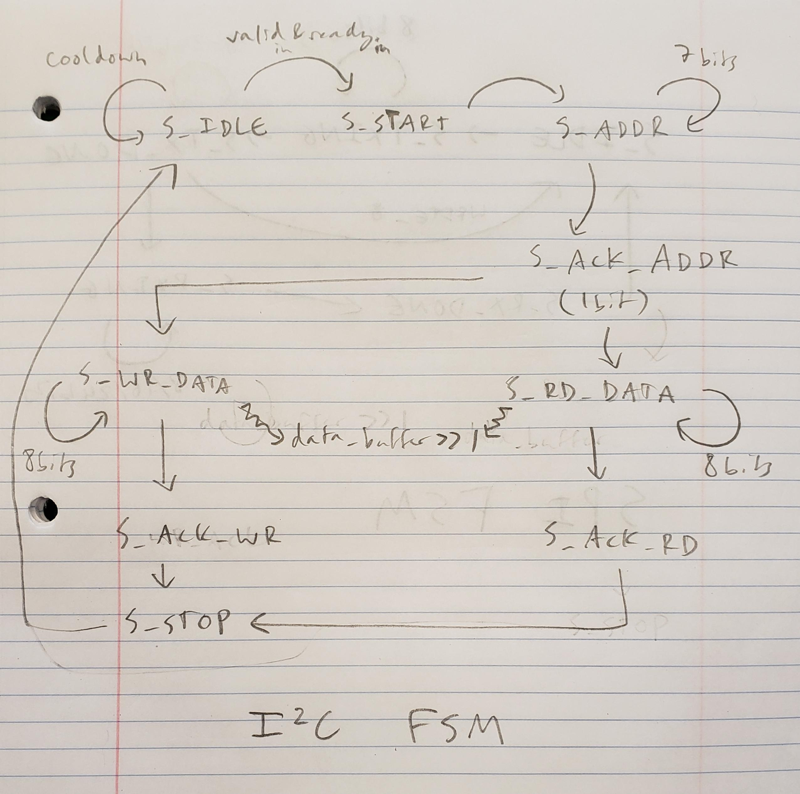

# Ian Eykamp Solutions Interpretation

Avinash said that an appropriate MVP for this project was to read throught the solutions to the lab and demonstrate my understanding of the solutions.

## SPI Controller

The SPI controller is driven by a bit counter that determines which bit is either being read or transmitted. On the negative edge of each `sclk` cycle, the bit counter is decremented by one until it reaches zero, at which point it is reset to the number of bits that need to be transmitted or received (depending on the configuration specified by the enum `spi_mode`).

On the transmit side, the line `mosi = tx_data[bit_counter[4:0]] & (state == S_TXING);` pulls the Main Out Secondary In (MOSI) line to the correct bit value. MOSI changes its bit value on the negative edge of `sclk` as `bit_counter` advances. It changes on the negative edge to avoid asynchronous timing issues on the secondary device. The `... & (state == S_TXING)` component is combinational logic that only allows MOSI to carry data when the FSM is in the `S_TXING` state.

On the receive side, the line `rx_data[bit_counter] <= miso;` reads in the bit that is expected on the Main In Secondary Out (MISO) line and stores it in the rx_data buffer at the correct index. This also occurs on the negative edge of `sckl`, so that the secondary device has the longest possible time to perform its logic and push its results onto the MISO line.

It is interesting to consider how the `sclk` line is controlled in the HDL. The statement `sclk <= ~sclk;` is directly analogous to the statement `#1 clk = ~clk` that is used to generate the regular clock signal in simulaion. It's like the main device is running a simulation on the secondary device to see how it responds to certain inputs!

## I2C Controller

Since the data line is shared between the main and secondary devices, the data line must be left floating by the main device when it is not being written. This is accomplished with the statement `assign sda = sda_oe ? sda_out : 1'bz;`, where `1'bz` is the high-impedance (floating) state.

Again, there is a `bit_counter` which controls when new data bits are read and written. Because each message in I2C is a constant small size (8 bits of address followed by 8 bits of data, etc.), the `bit_counter` values are slightly smaller than for SPI.

The FSM for the I2C controller has slightly more states than the SPI controller, because in addition to read and write states, it has to interpret which part of the message it is on. The message is strucured with a start bit, followed by a 7-bit address, address acknowledge bit, and then 8 bits of data. This structure is repeated for both reading and writing. The main thing that happens in each state is decrementing `bit_counter` and writing or reading and interpreting the proper bit from the `sda` line. The FSM stays on each state for the appropriate number of `scl` cycles before advancing to the next part of the message.

