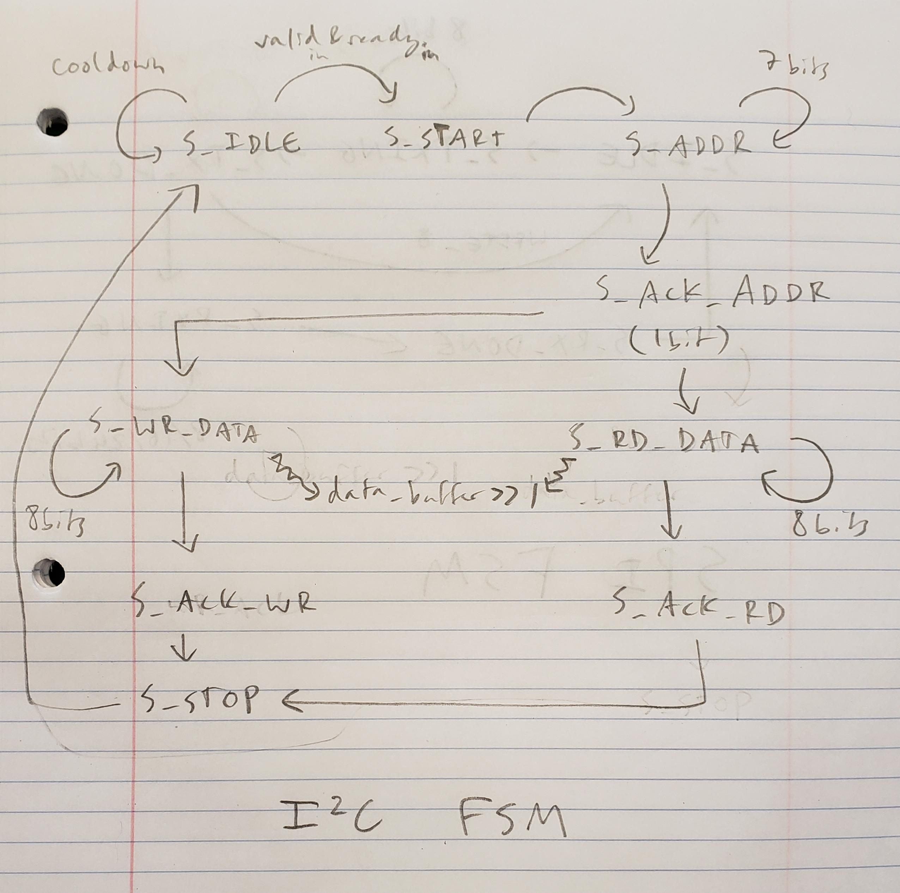

# Ian Eykamp Lab 2

## Signal Generators

I reused my signal generators from Homework 5. The schematics are shown in Figures 1-3.

**Figure 1.** Pulse generator schematic.

**Figure 2.** Triangle generator schematic.

**Figure 3.** PWM generator schematic.

## SPI Controller

Avinash said that an appropriate MVP for this project was to read throught the solutions to the lab and demonstrate my understanding of the solutions.

### Solution code
The SPI controller is driven by a bit counter that determines which bit is either being read or transmitted. On the negative edge of each `sclk` cycle, the bit counter is decremented by one until it reaches zero, at which point it is reset to the number of bits that need to be transmitted or received (depending on the configuration specified by the enum `spi_mode`).

On the transmit side, the line `mosi = tx_data[bit_counter[4:0]] & (state == S_TXING);` pulls the Main Out Secondary In (MOSI) line to the correct bit value. MOSI changes its bit value on the negative edge of `sclk` as `bit_counter` advances. It changes on the negative edge to avoid asynchronous timing issues on the secondary device. The `... & (state == S_TXING)` component is combinational logic that only allows MOSI to carry data when the FSM is in the `S_TXING` state.

On the receive side, the line `rx_data[bit_counter] <= miso;` reads in the bit that is expected on the Main In Secondary Out (MISO) line and stores it in the rx_data buffer at the correct index. This also occurs on the negative edge of `sckl`, so that the secondary device has the longest possible time to perform its logic and push its results onto the MISO line.

It is interesting to consider how the `sclk` line is controlled in the HDL. The statement `sclk <= ~sclk;` is directly analogous to the statement `#5 clk = ~clk;` that is used to generate the regular clock signal in simulation. It's like the main device is running a simulation on the secondary device to see how it responds to certain inputs!

**Figure 4.** SPI finite state machine diagram.

### ili9341_display_controller FSM
The `enable_test_pattern` input switches between hardcoding a test pattern of auto-generated squares and the actual data that it reads from the VRAM. The SPI wires are passed from the SPI controller module up to the highest level main code, where they are assigned as outputs in the `.xdc` file.

On init, the `ili9341_display_controller` FSM first goes through a series states in a linear order to configure the display. Then it enters a loop of iterating through the pixels one-by-one and waiting for the display to be ready to receive it before incrementing to the next pixel. After it has iterated through all the pixels, it returns to S_START_FRAME, which resets the pixel counter.

Side note that I found interesting: the INCREMENT_PIXEL step is essentially a function like you would write in a regular programming language, because it is a chunk of operations that gets run once before returning to a different state. From anywhere in the FSM, you can call the INCREMENT_PIXEL function by going to that state and waiting for it to return. If you wanted, you could specify a state to return to when done, such as is done with `state_after_wait`.

## I2C Controller

### Solution code
Since the data line is shared between the main and secondary devices, the data line must be left floating by the main device when it is not being written. This is accomplished with the statement `assign sda = sda_oe ? sda_out : 1'bz;`, where `1'bz` is the high-impedance (floating) state.

Again, there is a `bit_counter` which controls when new data bits are read and written. Because each message in I2C is a constant small size (8 bits of address followed by 8 bits of data, etc.), the `bit_counter` values are slightly smaller than for SPI.

The FSM for the I2C controller has slightly more states than the SPI controller, because in addition to read and write states, it has to interpret which part of the message it is on. The message is strucured with a start bit, followed by a 7-bit address, address acknowledge bit, and then 8 bits of data. This structure is repeated for both reading and writing. The main thing that happens in each state is decrementing `bit_counter` and writing or reading and interpreting the proper bit from the `sda` line. The FSM stays in each state for the appropriate number of `scl` cycles before advancing to the next part of the message.

**Figure 5.** I2C finite state machine diagram.

### ft6206_controller FSM

Again, the `sda` and `scl` wires are passed up to the highest--level module and assigned to output wires by the `.xdc` file.

The ft6206 reports data in a format specified in the `touch_t` struct, which includes x and y position, whether that pixel was being pressed, the amount of pressure, etc. One of the main jobs of the `ft6206_controller` module is to unpack all of this data bit by bit and assign it to the proper locations in the `touch_t` struct. This is done with the `active_register` case statement. The bits are read into a dynamic buffer named `touch[0]_buffer`, which is later copied all at once into the actual data register `touch[0]` that is assigned as an output of the module.

After each section of the buffer is read, it moves into the `S_WAIT_FOR_I2C_WR` state until the ft6206 controller gives the signal that the next set of bits is ready. The flow of the FSM is maintained by specifying `state_after_wait` before setting the state to `S_WAIT_FOR_I2C_WR`. Once the ready signal is detected, the FSM moves back into `state_after_wait` and continues from where it left off. Again, it's kind of like a function call!

## VRAM Controller

Implementing the VRAM controller was much easier than I expected. I consulted with Cara and Shamama about their FSM and then tried to emulate it as closely as I could in code. To my surprise, my implementation worked on the first try!

My FSM states are:

* S_IDLE: resets signals, moves directly to S_DRAWING. Cara and Shamama used this to make the FSM neater, so I included it, but I am confident I could have deleted it.
* S_DRAWING: simply takes the result of the touch screen reader, extracts its x and y position bits, and writes the color YELLOW to that address in the VRAM. The FSM never leaves this state until reset.
* S_START_CLEAR: The FSM enters this state after reset. It sets `vram_clear_counter` to the number of pixels, then moves to S_CLEARING.
* S_CLEARING: clears the pixel at index `vram_clear_counter`, then decrements the counter. When the counter reaches zero, it moves into S_IDLE, which then moves to S_DRAWING.

Included is a picture of my VRAM working!

**Figure 6.** My signature on the display!