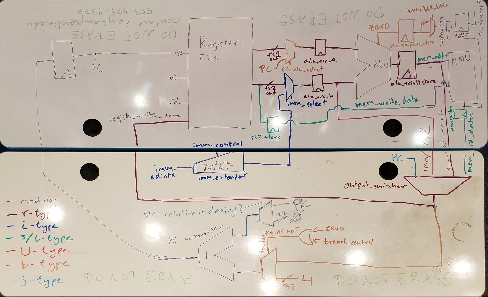
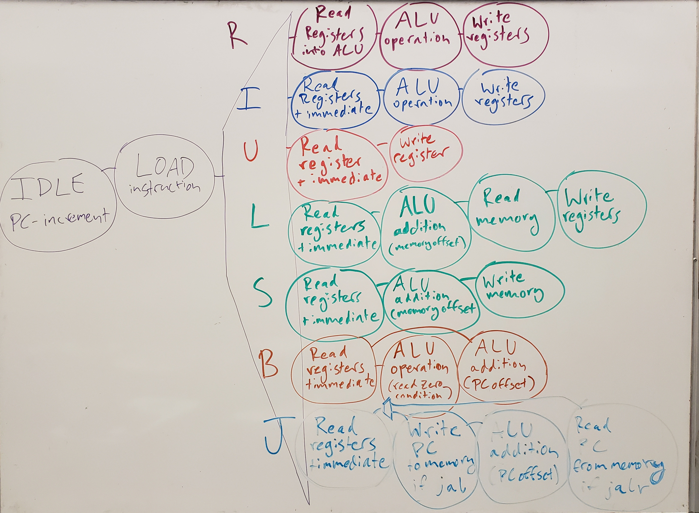

# Lab 3 Submission
## Ian Eykamp

---
## Implemented Instructions
### R-types
- [x] add
- [x] sub
- [x] xor
- [x] or
- [x] and
- [x] sll
- [x] srl
- [x] sra
- [x] slt
- [x] sltu
### I-types
- [x] addi
- [x] xori
- [x] ori
- [x] andi
- [x] slli
- [x] srli
- [x] srai
- [x] slti
- [x] sltiu
### Memory-Types (Loads/Stores)
- [x] lw
- [x] sw
- [ ] *lb*
- [ ] *lh*
- [ ] *lbu*
- [ ] *lhu*
- [ ] *sb*
- [ ] *sh*

### B-types (Branches)
- [x] beq
- [x] bne
- [x] *blt*
- [x] *bge*
- [x] *bltu*
- [x] *bgeu*
### J-types (Jumps)
- [x] jal
- [x] jalr (technically an i-type)
### U-types (Upper immediates)
- [x] *lui*
- [ ] *auipc*

---
## HDL

**Figure 1: Multicycle CPU schematic.**

### Base Modules (thin purple)

The main components of the multicycle cpu are the register file, ALU, and MMU. I chose to also instantiate a designated PC incrementer, which is just another adder. There is one register that holds the current Program Counter (PC), and another register that holds the current instruction, such that the cpu controller can always refer to certain bits in the instruction. The other registers and muxes will be described in their specific sections.

Every instruction starts by incrementing the PC, resetting the control signals to all of the registers and muxes, then reading the instruction at address PC from memory and storing it in the instruction register. From there, the op-code determines the branch of the finite state machine to interpret the instruction correctly (see Figure 2).

### R-Type Instructions (dark purple)

An R-type instruction reads the two addresses `rs1` and `rs2` from the register file and stores them in `alu_src_a` and `alu_src_b`, respectively. On the next cycle, these values are read into the ALU and stored as `alu_result`. Then this value is written back to the register at the address `rd` specified in the instruction.

### I-Type Instructions (dark blue)

For I-type instructions, the 12-bit immediate value is parsed by the decoder and fed into the immediate extender, which is a module I created. The `imm_control` signal determines which bit swizzling scheme to use depending on the instruction type, and the `imm_select` signal controls whether the immediate value or `rs2` should be read into `alu_src_b`.

### U-Type Instructions (red)

For the U-type instruction `lui`, the appropriately extended immediate value is stored in `alu_src_b` and then immediately written into the register file at address `rd`.

### S/L-Type Instructions (greenish)

For S/L-type instructions, additional connections are made to the MMU. For the store word instruction, the value from `rs2` is held in its own register so that the immediate value can be added to `rs1` and used to set the memory address. The ALU output is connected to the `mem_addr` port, and the `mem_rd_data` value is stored in a register before being written back to the register file during the load word instruction.

### B-Type Instructions (brown)

For B-type instructions, the `zero` output of the ALU is used to compare the register file values `rs1` and `rs2`. For the equality comparison, the ALU is set to subtraction; the values are equal if the result is zero. For magnitude comparisons, the ALU is set to `SLT` or `SLTU`, and `rs1` is greaten than or equal to `rs2` if the result is zero. A simple not gate returns the opposite result for the `bne`, `blt`, and `bltu` instructions.

The output of the zero result controls whether the ALU result or simply 4 is added to the Program Counter before the next instruction.

### J-Type Instructions (light blue)

For the `jal` instruction, the current PC is written to the register file. This can occur while the ALU result is still being calculated. The ALU adds an immediate value to the current PC and writes that result to the PC.

For the `jalr` instruction, the ALU adds an immediate value to the PC location stored in register `rs1`. Then the result is written to the PC.

For J-type instructions, the PC incrementer is configured to write the new value directly to the PC. This is accomplished with the `PC_relative_indexing` mux, which adds the increment to a constant `32'b0` instead of adding it to the current PC.

---
## FSM

**Figure 2: Multicycle CPU FSM diagram.**

Because it is a multi-cycle CPU, the finite state machine (FSM) breaks each instruction into a number of discrete steps, such that each step requires a shorter minimum clock period. This implementation is also a step towards pipelining, as another instruction can be loaded and executed while the previous instruction has made it partway through the FSM.

Figure 2 is not a 1-1 correspondence with the finite state machine as implemented; in general, the hdl implementation is more verbose. In particular, there is an additional state at the start and end of each instruction type (for example, `R_START` and `R_DONE`), which serve no other purpose than to improve readability. I also added intermediate states between certain states as needed such that the output of one state was guaranteed to be valid before the next state was ready. This tended to be needed when reading data from the MMU.

---
## Testing: Executing an Assembly File

The most advanced test case to run is the instruction set in `asm/all_instructions.s`. The instructions that have not been implemented have been commented out. I have not verified the entire program, but the first 10 instructions or so are correct, and the correct registers change at the appropriate time. Best of all, it never crashes.

To run this test case, run `make test_rv32i_all_types` from the top-level directory, then run `make waves_rv32i_system`. This should load GTKwave with the first few registers showing.